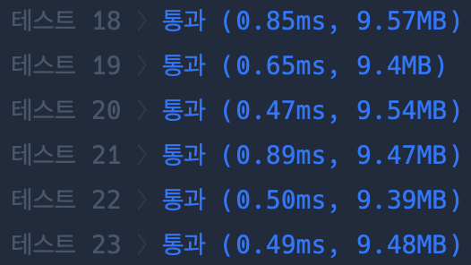
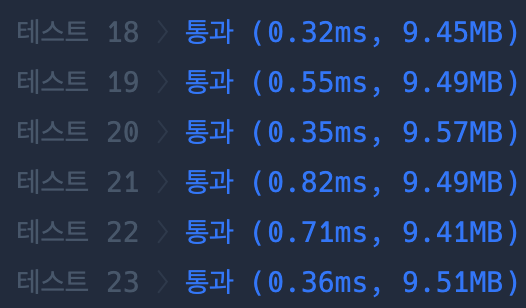

# 11 주차

---

## 문제 링크 🔗

- 문제 2: [[PCCP 기출문제] 4번 / 수식 복원하기](https://school.programmers.co.kr/learn/courses/30/lessons/340210)

---

## 문제 요약

1. 답이 'X'가 아닌 수식들에서 base의 최솟값이 될 수 있는 최댓값을 구하기
   1. 'a + b = c'에서 a, b, c들의 자릿값을 10진수로 변환했을 때의 최댓값에 +1 더한 것이, base가 가질 수 있는 진법의 최솟값임
   2. ex) '10'에서 최댓값은 1이고, 진법은 최소 1+1, 즉 2진법부터 3진법~9진법이 후보가 될 수 있음
2. min_base ~ 9 사이의 값을 답이 'X'가 아닌 수식들에 넣어서 계산해보며, 모든 수식에게 유효하다면 진법 후보로 저장해둠
3. 진법 후보들을 토대로 'X'의 값을 구한다
   1. **주의** 진법이 여러개 가능하다고 해서 무조건 '?'를 표시하는 것이 아님. 여러 개의 진법을 사용하더라도 'X'의 값들이 같다면 정상적으로 계산한 'X'값을 표시 함 -> 그래서 set()을 사용하는 것
4. 구한 expr들을 ans에 append하여 print한다

---

## 나의 풀이 ✏️

```python
  def n_to_ten(n, base):
    temp = 0
    idx = 0
    for digit in reversed(n):
        temp += int(digit) * (base ** idx)
        idx+=1
    return temp

def ten_to_n (n, base):
    if n == 0:
        return "0"
    temp = ""
    while n > 0:
        temp = str(n % base) + temp
        n //= base
    return temp

def solution(expressions):
    answer = []
    
    # 진법 후보의 최댓값 구하기
    max_base = 0
    for exp in expressions:
        for char in exp:
            if '0' <= char <= '9':
                max_base = max(max_base, int(char))
    
    min_base = max_base + 1
    
    # 정답 진법이 될 수 있는 후보군 산정
    possible_bases = []
    for base in range(min_base, 10):
        is_match = True
        for exp in expressions:
            a, op, b, _, c = exp.split()
            
            if c == 'X': 
                continue
            
            # 10진수로 변환하여 계산
            val_a = n_to_ten(a, base)
            val_b = n_to_ten(b, base)
            val_c = n_to_ten(c, base)
            
            if op == '+':
                if val_a + val_b != val_c:
                    is_match = False
                    break
            else:
                if val_a - val_b != val_c:
                    is_match = False
                    break
        
        if is_match:
            possible_bases.append(base)

    # 수식 복원하기
    for exp in expressions:
        a, op, b, _, c = exp.split()
        
        if c != 'X': 
            continue
        
        # 가능한 모든 진법으로 계산해보기
        results = set()
        for base in possible_bases:
            val_a = n_to_ten(a, base)
            val_b = n_to_ten(b, base)
            
            if op == '+':
                res_10 = (val_a + val_b) 
            else:
                res_10 = (val_a - val_b)

            # 다시 n진법으로 변환하여 set에 저장
            results.add(ten_to_n(res_10, base))
        
        # 정정한 수식 저장
        if len(results) == 1:
            res_real = list(results)[0]
            answer.append(f"{a} {op} {b} = {res_real}")
        else:
            answer.append(f"{a} {op} {b} = ?")
            
    return answer
```

### 접근 방식

- 아이디어:
  1. 답이 'X'가 아닌 수식들에서 진법 후보군 구하기
  2. 답이 'X'인 수식들에서 진법 후보군을 대입하며 가능한 값을 찾기
  3. 새로이 구한 'X'값을 포함한 수식들을 출력하기
- 사용한 자료구조/알고리즘: 완전탐색
- 선택 이유: 진법 후보군이 최대 2~9이므로 비교적 적은 횟수 반복하기 때문

### 복잡도 (나의 풀이)

- 시간 복잡도: O(n)

### 실행 결과 (나의 풀이)

- 통과 여부: Y
- 실행 시간/메모리: 테스트 18 〉 통과 (0.85ms, 9.57MB)

### 개선할 점

파이썬 내장 함수인 int(string, base) 사용해보기 -> 내장 함수인만큼 내부 구현이 최적화되어 있기 때문에 조금 더 성능을 향상시킬 수 있음
base 진법으로 되어 있는 string을 10진법으로 변환할 수 있다고 한다.
**다만 10 -> n 진법은 별도의 구현이 필요하다.(2, 4, 16은 내장 함수가 따로 있긴 함)**

---

## 개선된 풀이 👍

```Python
  def ten_to_n(n, base):
    # 파이썬 내장 함수가 없으므로 유지)
    if n == 0: return "0"
    temp = ""
    while n > 0:
        temp = str(n % base) + temp
        n //= base
    return temp

def solution(expressions):
    answer = []

    max_digit = 0
    for exp in expressions:
        for char in exp:
            if '0' <= char <= '9':
                max_digit = max(max_digit, int(char))
    min_base = max(2, max_digit + 1)
    
    # int(s, base) 활용
    possible_bases = []
    for base in range(min_base, 10):
        is_match = True
        for exp in expressions:
            a, op, b, _, c = exp.split()
            if c == 'X': continue

            val_a, val_b, val_c = int(a, base), int(b, base), int(c, base)
            
            if op == '+' and val_a + val_b != val_c:
                is_match = False; break
            elif op == '-' and val_a - val_b != val_c:
                is_match = False; break
        
        if is_match:
            possible_bases.append(base)

    for exp in expressions:
        a, op, b, _, c = exp.split()
        if c != 'X': continue
        
        results = set()
        for base in possible_bases:
            # 여기서도 int(s, base) 활용
            val_a, val_b = int(a, base), int(b, base)
            res_10 = (val_a + val_b) if op == '+' else (val_a - val_b)
            results.add(ten_to_n(res_10, base))
        
        if len(results) == 1:
            answer.append(f"{a} {op} {b} = {list(results)[0]}")
        else:
            answer.append(f"{a} {op} {b} = ?")
            
    return answer
```

### 변경 사항 요약

- 변경 내용: 내장 함수 사용
- 개선 효과: 내장 함수 사용으로 인해 평균 실행 시간 감소

### 복잡도 (개선된 풀이)

- 시간 복잡도: O(n)

### 실행 결과 (개선된 풀이)

<내 풀이>


<개선된 풀이>


- 통과 여부: Y
- 실행 시간/메모리: 테스트 18 〉 통과 (0.32ms, 9.45MB)

---

## 결론

- 성능 면에서는 최적화되어 있는 내장함수를 쓰는 것이 성능 향상에 더 유리할 수 있다.
- 하지만 학습 측면에서는 직접 구현하며 동작을 이해하는 것이 더 좋다고 생각한다.

---

## 배운 점 🌱

문제가 길고 어려워보여도, 조건을 찬찬히 파악하면 충분히 풀 수 있다. 너무 겁먹지 말자!
